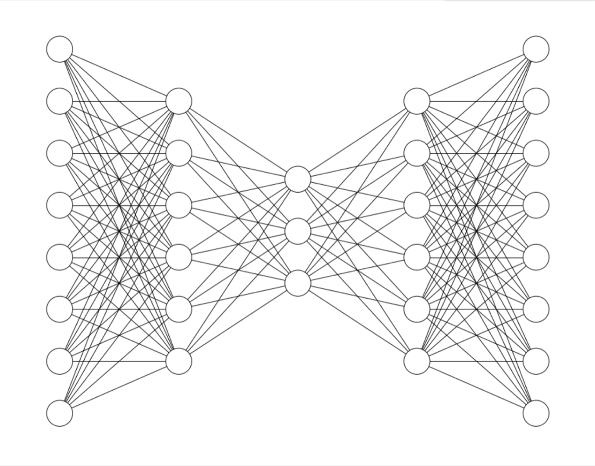
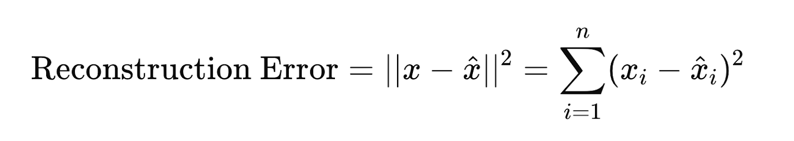
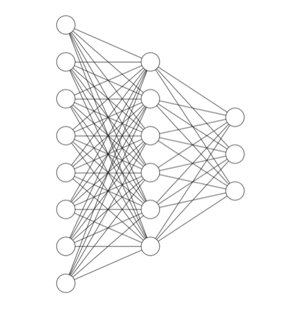
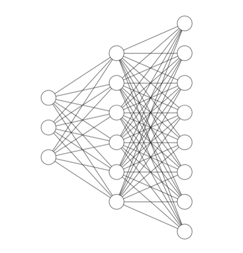
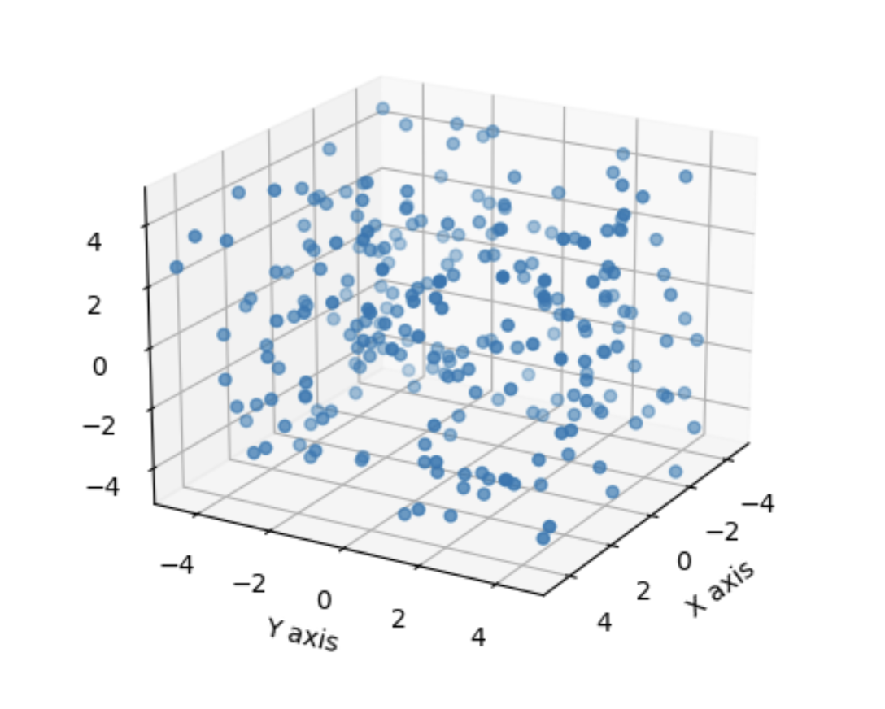
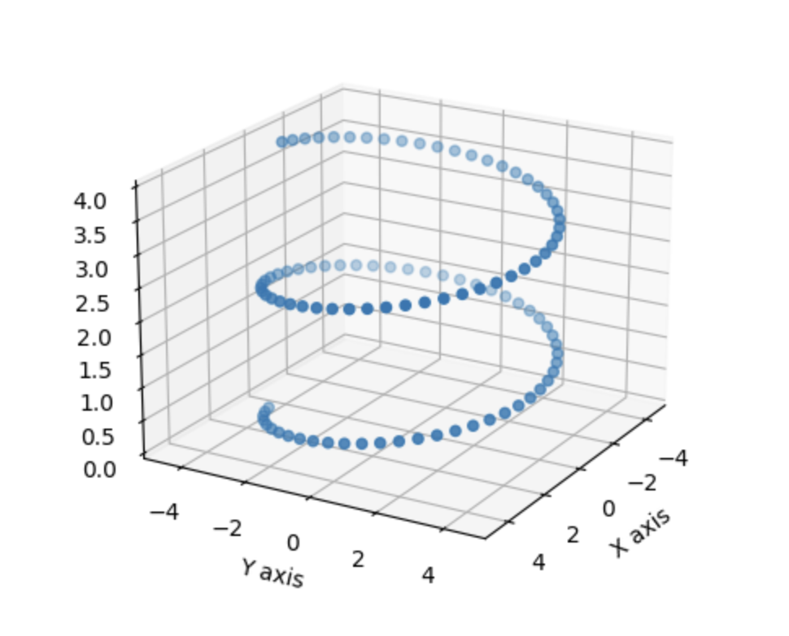
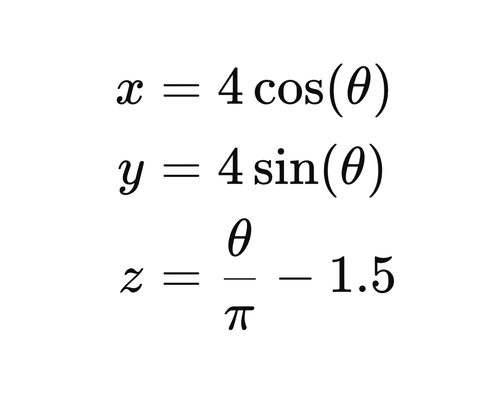
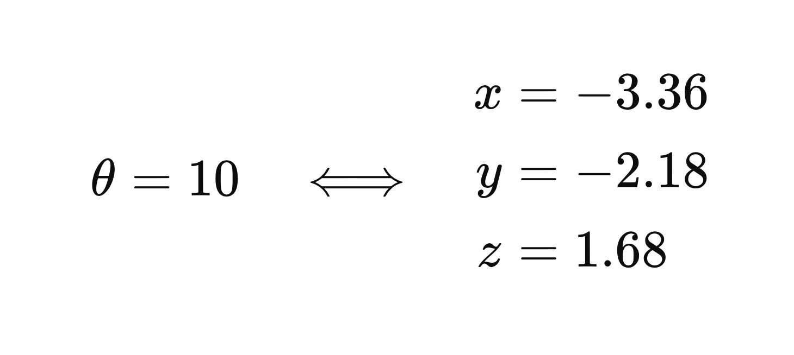
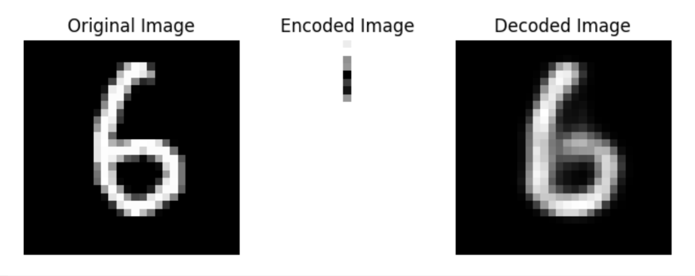

In modern machine learning, autoencoders, encoders, and decoders appear everywhere. They are critical components in the most high performing industry models across all modalities. In this article we will explore this architecture, building up an intuition for what it does, what makes it useful, and how to use it yourself.

## The Basics

This is an auto encoder:

<figure class="blog-figure" style="max-width: 860px">

</figure>

An autoencoder does two things:

- It compresses its input data into a lower dimension
- It attempts to reconstruct the original input from the lower dimensional data

The difference between the reconstructed data and the original input is called the “Reconstruction error.” The autoencoder is trained to minimize the total reconstruction error across the dataset.

<figure class="blog-figure" style="max-width: 659px">

<figcaption>If you have experience with machine learning this formula may look familiar; it’s the formula for SSE (sum of squared errors) but instead for using y for the target output you’re using x, because in the case of autoencoders the target output and predicted output of the model is the input.</figcaption>
</figure>

## The Encoder and Decoder

The first part of the network is called the encoder. Its job is to create a lower dimensional representation of the input data that can be “passed through” the middle layer. The values of this middle layer are that lower dimensional representation.

The two main terms for this lower dimensional representation that I will use throughout this article are “embedding” and “latent space representation.”

<figure class="blog-figure" style="max-width: 200px">

</figure>

The second part of the network is the decoder. Its job is to take the embedding and reconstruct the original input from that embedding.

To reconstruct the input effectively, the information from the input must pass through the middle layer. By training the neural network to minimize the reconstruction error, the network must find an efficient lower dimensional representation of the input data.

<figure class="blog-figure" style="max-width: 200px">

</figure>

## Lower Dimensional Subspaces

Why does creating a lower dimensional representation of the data make sense? Why is doing this even possible? Very often your data doesn’t span the full space of possibilities. The best way to understand this is with an example. Let’s say you have a dataset of 1000×1000 RGB images of airplanes, and exclusively airplanes. Each image is represented by 3 million numbers, and can be thought of as a point in 3 million dimensional space. This 3 million dimensional space could also contain 1000×1000 RGB images of anything else in the universe. Cats, iPhones, abstract art, static noise, and black and white images of planets are all points that exist in this 3 million dimensional space. But your dataset contains images of airplanes exclusively. If you were to plot your data in this space, most of the space would be empty. Your dataset would form a distinct structure within the space, and could therefore be projected onto a lower dimensional subspace.

Since we can’t think in 3 million dimensions, let’s consider an example in 3 dimensions. Here are a bunch of points scattered in a 3 dimensional space.

<figure class="blog-figure" style="max-width: 500px">

<figcaption>Figure 1</figcaption>
</figure>

These points are randomly scattered throughout the space, so we can’t describe the location of any of these points with less than 3 numbers. But let’s consider a case in the same space where the data has structure:

<figure class="blog-figure" style="max-width: 500px">

<figcaption>In our airplane dataset example, you can think of figure 1 as representing all possible images. This figure represents only images of airplanes</figcaption>
</figure>

In this case, you can still describe the location of a point with 3 numbers, but doing so is inefficient. Because the data falls on a one dimensional spiral, it’s possible to describe the location of a point with one number without losing any information.

What we need to do this is a transformation function; a way of mapping the 3 dimensional coordinate of a point to one dimension, and from one dimension back to three. In the case of the spiral shown above we know the transformation function exactly. Here is the function for mapping from 1 to 3 dimensions:

<figure class="blog-figure" style="max-width: 430px">

</figure>

And this is how the bidirectional mapping looks for a single point:

<figure class="blog-figure" style="max-width: 430px">

</figure>

This is all an autoencoder is doing, except the mapping is learned. The encoder learns to map the input data to a lower dimensional subspace, and the decoder learns to map from that subspace back to the original high dimensional representation of the data. Because the data is not uniformly distributed, the autoencoder is learning and taking advantage of the structure of the data to do this mapping.

Some of you reading may find encoders very conceptually similar to principal component analysis (PCA). In fact, a single layer encoder with linear activation functions will find *almost* exactly the same solution as PCA. The key difference is that PCA ensures that each value in the hidden layer representation represents orthogonal dimensions. For an autoencoder with linear activation functions to converge to this same representation, you need to initialize the weights using the singular value decomposition of the data matrix. Due to the stochastic nature of batched gradient descent, convergence isn’t technically guaranteed under this condition, nor prohibited without it, but using the singular value decomposition of the data matrix will guide the autoencoder to find a lower dimensional projection that closely resembles the one found by PCA.

## Training an Autoencoder

Just for fun, let’s train an autoencoder. My laptop can’t handle a 3 million dimensional dataset, so let’s instead use the MNIST dataset of handwritten digits. If you’re unfamiliar, the MNIST dataset contains black and white images that are 28×28 pixels — so our data has 784 dimensions.

First we’ll do the necessary imports

```python
import keras
from keras.datasets import mnist
from keras.layers import Dense
from keras.models import Model
import numpy as np
import matplotlib.pyplot as plt
from mpl_toolkits.axes_grid1 import ImageGrid
```

Then prepare the dataset:

```python
# Load the data
(x_train, _), (x_test, _) = mnist.load_data()
num_pixels = x_train.shape[1] * x_train.shape[2]
# Flatten and normalize the data
x_train = x_train.reshape(x_train.shape[0], num_pixels).astype('float32') / 255
x_test = x_test.reshape(x_test.shape[0], num_pixels).astype('float32') / 255
```

Later in this article we’re going to want an outlier in our dataset, so I’m including it here. To find out why, keep reading! To simulate outliers, we will include some fashion images in our dataset.

```python
(fashion_x_train, _), (fashion_x_test, _) = fashion_mnist.load_data()
fashion_x_train = fashion_x_train[:1] # Let's use 1 outlier
x_train = np.concatenate((x_train, fashion_x_train), axis=0)
np.random.shuffle(x_train) # Shuffling the dataset so we don't know where the outlier is
```

Now we’ll build the autoencoder. It will have 6 layers, with the middle layer having only 8 nodes. This means the model needs to learn a representation of 784 dimensional data using only 8 dimensions.

```python
autoencoder = keras.Sequential()
autoencoder.add(Dense(128, activation='relu', input_shape=(num_pixels,)))  
autoencoder.add(Dense(32, activation='relu')) 
autoencoder.add(Dense(8, activation='sigmoid')) 
autoencoder.add(Dense(32, activation='relu')) 
autoencoder.add(Dense(128, activation='relu'))
autoencoder.add(Dense(num_pixels, activation='sigmoid'))
print("Total parameters:", autoencoder.count_params())
```

Notice how the embedding layer has a sigmoid activation function. Later on we’ll be generating some random points in the embedding space, and so constraining the space to between 0 and 1 makes this easier. The last layer has a sigmoid activation function too. This is because we normalized the pixel values of the inputs to between 0 and 1 (by dividing by 255), so it helps to constrain the output to be in the same range.

This neural network has 210,520 parameters. Fun fact: this means it is just over 831,274 time smaller than GPT-3.

Now we’ll train it.

```python
autoencoder.fit(x_train, x_train,
                epochs=50,
                batch_size=256,
                shuffle=True,
                validation_data=(x_test, x_test))
```

We can use the encoder and decoder separately:

```python
encoder = keras.Sequential(autoencoder.layers[:3])
decoder = keras.Sequential(autoencoder.layers[3:])
```

We’ll be displaying the model inputs and outputs at different layers later so this display function will help us:

```python
def display(images, padding=1, figsize=(8, 4)):
   fig = plt.figure(figsize=figsize)
   grid = ImageGrid(fig, 111, nrows_ncols=(1, len(images)), axes_pad=padding)


   for i, (image, title) in enumerate(images):
       if image.size == 8:
           reshaped_image = image.reshape(8, 1)
       elif image.size == 784:
           reshaped_image = image.reshape(28, 28)
       else:
           raise ValueError("Image size not supported")


       ax = grid[i]
       ax.imshow(reshaped_image, cmap='gray')
       ax.set_title(title)
       ax.axis('off')


   plt.show()
```

Now we can view how the model did visually. What we’ll plot will be the original image, the encoded representation of the image, and then the decoded image. By changing image_index you can view different images.

```python
image_index = 21  # You can change this to view different images


images = [
   (x_test[image_index], "Original Image"),
   (encoded_imgs[image_index], "Encoded Image"),
   (decoded_imgs[image_index], "Decoded Image")
   ]


display(images)
```

<figure class="blog-figure" style="max-width: 860px">

</figure>

The above three images show that our model learned an efficient representation of the 784 dimensional input image using 8 dimensions, and was able to reconstruct a highly similar image using the 8 dimensional representation.

I’m sure you’re thinking this is all very interesting. But why is it useful? What tools can we build with this? To find out, read [part 2](post.html?id=autoencoders-2).
