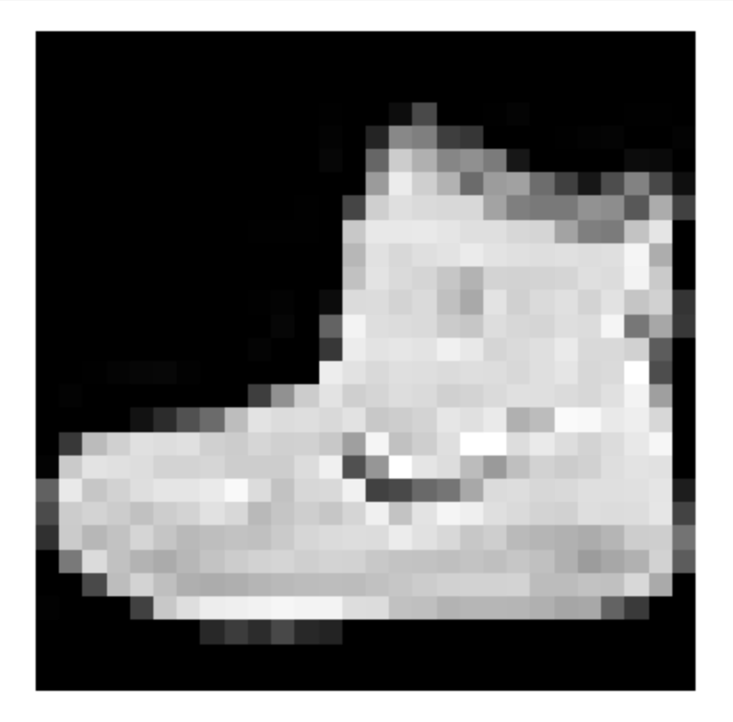
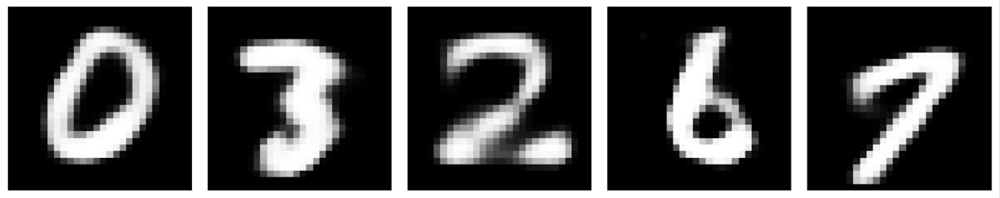
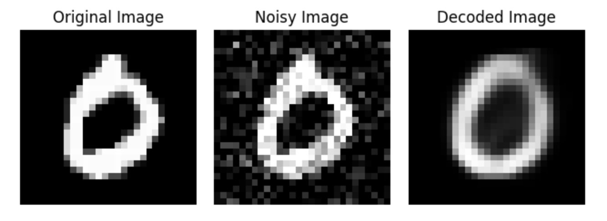
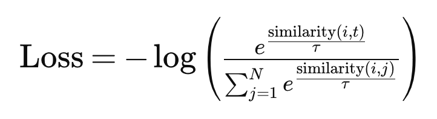
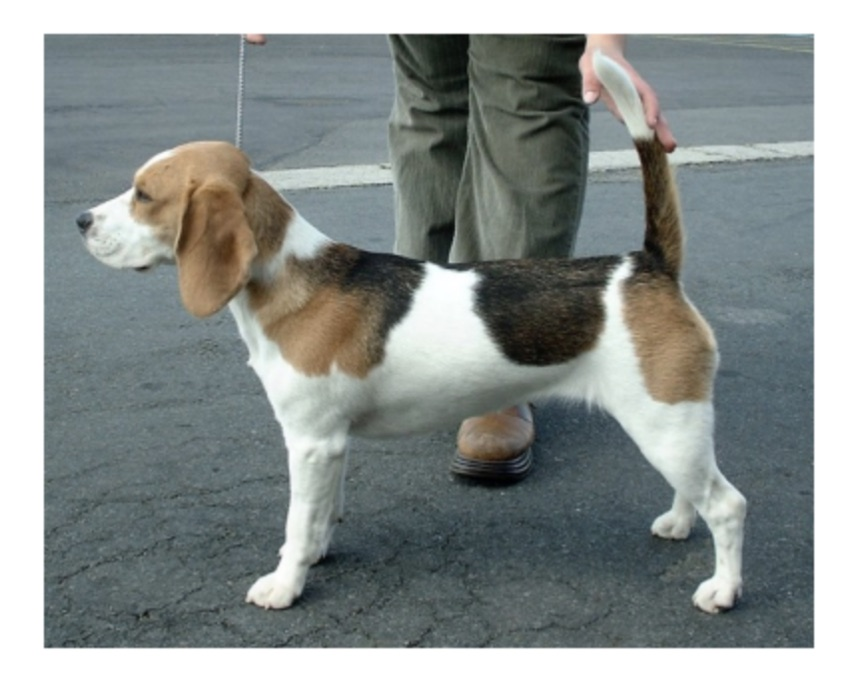
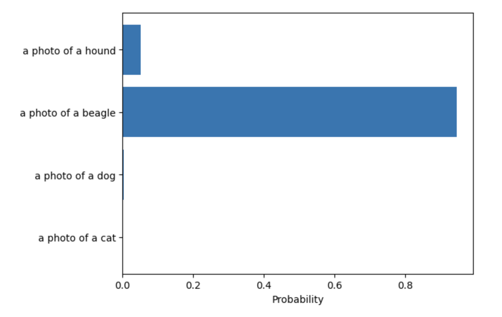

This is part two of a two part series on autoencoders. In [part one](post.html?id=autoencoders-1), we talked about how autoencoders work, and trained one ourselves. Now we will use this autoencoder to showcase a few common use cases for this architecture. Let’s jump right in.

## Identifying Outliers

Let’s say your airplane dataset might have a few images of cats in it, and you want to remove those images without manually checking each image yourself. One way would be to train a model to classify an image as a cat or an airplane, but this would require gathering an additional dataset of cat images. A better approach is to use an autoencoder. Start by training an autoencoder on your airplane dataset. This autoencoder will learn the structure of your dataset and will have a very low reconstruction error on images of airplanes. However, for images that aren’t airplanes, the reconstruction error will be high. Sort the dataset by reconstruction error, and you’ll be able to easily identify all the non airplane images your dataset contained.

In our three dimensional example you can think about it like this. All the images of airplanes fall along the spiral. But the image of a cat would appear somewhere far off of the spiral. The encoder would compress the image of the cat down to the one dimensional subspace, forcing it onto the one dimensional representation of the spiral. The decoder would then map that point on the spiral back to three dimensional space. Your image of a cat would, after going through the autoencoder, appear directly on the spiral along with the images of airplanes. But your original image was far off of the spiral. The distance between these two points (the reconstruction error) is much higher than points that originally were a part of the spiral, and so it can be identified as an outlier.

When preparing the handwritten digits dataset for training the autoencoder, you may have noticed I included an outlier: a picture from the fashion dataset. I even shuffled the training dataset to make sure I didn’t know where in the training data the outlier was. Let’s see if we can find it. To do that, we’ll first compute the reconstruction error of every example individually, then sort the training dataset indices based on the reconstruction error.

```python
reconstruction_errors = np.sum(np.square(x_train - decoded_training_imgs), axis=1)
sorted_indices = np.argsort(reconstruction_errors)
print(sorted_indices[-1])
```

The printed value I got was 52535, meaning for me x_train[52535] should be the outlier.

```python
plt.imshow(x_train[sorted_indices[-1]].reshape(28, 28), cmap='gray')
plt.axis('off') 
plt.show()
```

<figure class="blog-figure" style="max-width: 200px">

</figure>

It worked! Our outlier was an image of a shoe.

## Variational Autoencoders

A variational autoencoder can create new data points that resemble the dataset. By sampling a point from the latent space and then mapping it back to the dimensionality of the original input, a brand new data point can be generated. With a sufficiently large model, you could generate a new image of an airplane in this way. This makes variational autoencoders useful for data augmentation – if you have a scarce dataset, you can generate more points.

Let’s see if our model can do this. We’ll sample a point from the latent space randomly, run it through the decoder, and display it.

```python
latent_space_sample = np.random.rand(8,1) # random sample from the latent space
latent_space_sample = latent_space_sample.reshape(1,8).astype('float32') # reshape the sample
latent_space_sample_decoded = decoder.predict(latent_space_sample) # decode the sample
display([(latent_space_sample_decoded,"")]) # display the sample
```

I compiled a list of a few examples that I liked:

```python
generated_data = []
```

```python
generated_data.append((latent_space_sample_decoded, "")) # run this line by itself for each sample generated you want to include
```

```python
display(generated_data, padding=0.2, figsize=(16, 4))
```

Keep in mind these handwritten digits did not exist in the dataset, they were created by the decoder.

<figure class="blog-figure" style="max-width: 860px">

<figcaption>While some examples looked amazing, I found only about 25-33% were this high quality. The rest looked like combinations of numbers (e.g. a mix between an 8 and a 3, a 4 and a 9, or a 0 and a 6). To solve this problem and create a more robust handwritten digit generator, we would need a better way of selecting a point from the latent space to feed into the decoder</figcaption>
</figure>

## Data Denoising

Similarly to the above example, you can remove noise from a dataset. If you started off with a noisy spiral (each point not falling perfectly on the spiral but slightly off of it), after putting each example through the autoencoder, the resulting spiral would have much less noise — each point would fall closer to being directly on the spiral. This is useful for cases where data quality is very important.

In the case of the handwritten digit dataset we’ve been using, we can simulate noisy data by adding Gaussian noise to the data ourselves.

```python
image_index = 3
original_image = x_test[image_index]
# Add Gaussian noise to the original image
sigma = 0.2
noise = np.random.normal(0, sigma, original_image.shape)
noisy_image = original_image + noise
noisy_image = np.clip(noisy_image, 0, 1) # Clip the values to be between 0 and 1 in case the Gaussian noise caused pixel values to be out of bounds
```

Then running the noisy image through the autoencoder:

```python
noisy_image = noisy_image.reshape(1,784).astype('float32')
encoded_noisy_image = encoder.predict(noisy_image)
decoded_noisy_image = decoder.predict(encoded_noisy_image)
```

And display the results.

```python
images = [
   (original_image, "Original Image"),
   (noisy_image, "Noisy Image"),
   (decoded_noisy_image, "Decoded Image")
   ]

display(images)
```

<figure class="blog-figure" style="max-width: 700px">

</figure>

The decoded image has the features of the original image (it’s clearly a zero) but without any of the noise present in the noisy image.

## CLIP

One of the coolest uses of encoders I’ve seen is the Contrastive Language-Image Pretraining (CLIP) model by OpenAI. The purpose of this model is to be a general image classifier. CLIP can categorize images into any set of categories you want without the need to train the model further. Rather than the traditional approach of training a new neural network every time you need a new image classifier, you can just use CLIP.

CLIP was trained on a massive dataset of text-image pairs from across the internet. Each point in the dataset was an image and the unstructured text that was scraped alongside that image.

Then, two encoders were trained. One was trained to map images to a latent space, and the other was trained to map text to that same latent space. The key feature of this training procedure was that it used a contrastive loss function. The primary goal of this type of loss function is to maximize the similarity between the embeddings of images and text that correspond with each other, while minimizing the similarity between non matching text-image pairs. In other words it seeks to minimize the distance between the latent space representations of images and text that correspond to each other while maximizing the distance between images and text that do not. A contrastive loss function looks something like this:

<figure class="blog-figure" style="max-width: 500px">

</figure>

- In this formula “similarity” represents a function that computes the similarity of a text-image pair, and is something like euclidean distance, cosine similarity, or dot product.
- tau is the temperature parameter, which adjusts the scale of the similarity scores.
- The denominator is what aims to distinguish the matching image-text pair from the mismatched pairs.

Using the model is very straightforward. Start by obtaining an embedding for each one of your categories using the text encoder. The input to the text encoder can be something like “an image of a cat” or “an image of the letter C.” Using natural language rather than just “cat” and “C” is beneficial because unstructured natural language data was used to train the text encoder. Then, for any image you want to classify, obtain an embedding for that image using the image encoder. Compare the image embedding with each of the text embeddings. Whichever text embedding is most similar to the image embedding, return that as the selected classification.

Let’s try running it. First we’ll load dependencies and setup the model. Make sure you have transformers installed:

```python
!pip install transformers
```

```python
from PIL import Image
import requests
import matplotlib.pyplot as plt
from io import BytesIO
from transformers import CLIPProcessor, CLIPModel


class Result:
 def __init__(self, prediction, probs, image, text):
   self.prediction = prediction
   self.probs = probs
   self.image = image
   self.text = text


class myCLIP():
 def __init__(self):
   self.model = CLIPModel.from_pretrained("openai/clip-vit-base-patch32")
   self.processor = CLIPProcessor.from_pretrained("openai/clip-vit-base-patch32")
   self.lastResult = None


 def forward(self, image, text):
   inputs = self.processor(text=text, images=image, return_tensors="pt", padding=True)
   outputs = self.model(**inputs)
   logits_per_image = outputs.logits_per_image  # this is the image/text similarity score
   probs = logits_per_image.softmax(dim=1)  # taking the softmax will give us the label probabilities
   prediction = text[probs.argmax(dim=1)]
   probs = probs.tolist()[0]
   self.lastResult = Result(prediction, probs, image, text)
   return prediction


 def displayResult(self, width_in_inches=5):


   # Display the image
   aspect_ratio = image.size[1] / image.size[0]
   height_in_inches = width_in_inches * aspect_ratio
   plt.figure(figsize=(width_in_inches, height_in_inches))
   plt.imshow(self.lastResult.image)
   plt.axis('off')
   plt.show()


   # Display a histogram of the text class probabilities
   plt.barh(self.lastResult.text, self.lastResult.probs)
   plt.xlabel('Probability')
   plt.show()


   print(f"Prediction: {self.lastResult.prediction}, {max(self.lastResult.probs) * 100:.2f}%")
```

Now we can load and run the model.

```python
# load the model
model = myCLIP()

# obtain an image
url = "https://upload.wikimedia.org/wikipedia/commons/5/55/Beagle_600.jpg"
response = requests.get(url)
image = Image.open(BytesIO(response.content))

# these are our text classes
text = ["a photo of a cat", "a photo of a dog", "a photo of a beagle", "a photo of a hound"]

# run the model and then display the result
prediction = model.forward(image, text)
model.displayResult()
```

<div class="blog-figure-row">
<figure class="blog-figure" style="max-width: 340px">

</figure>
<figure class="blog-figure" style="max-width: 420px">

</figure>
</div>

As you can see, CLIP selects the most relevant category from the given list of options.

It would be easy to think that because CLIP is a general model it would need to be fine tuned on a specific dataset/set of classes to achieve world class performance on that dataset, but this is not the case. OpenAI’s research found that “The best CLIP model outperforms the best publicly available ImageNet model, the Noisy Student EfficientNet-L2, on 20 out of 26 different transfer datasets we tested.” These datasets included a wide variety of image types like fine-grained object classification, geo-localization, action recognition in videos, and OCR. It is the encoder based architecture of CLIP that allows it to learn OCR, a skill that typical ImageNet models do not exhibit.

CLIP highlights an important use case for encoders and decoders: the ability to create a unified representation of fundamentally different types of data. Multimodal models owe much of their success to these architectures.

## Efficient Training

Another notable use for encoders and decoders is to create more compact training data. By reducing the dimensionality of the dataset, models can be trained much more efficiently. The text to video model SORA makes use of this approach ([Brooks, Peebles, et al.](https://openai.com/research/video-generation-models-as-world-simulators)).

> “We train a network that reduces the dimensionality of visual data. This network takes raw video as input and outputs a latent representation that is compressed both temporally and spatially. Sora is trained on and subsequently generates videos within this compressed latent space. We also train a corresponding decoder model that maps generated latents back to pixel space.”

In conclustion, autoencoders, encoders, and decoders are powerful architectures that are applicable to a wide variety of problems and are absolutely essential tools in the world of machine learning today. They’re used as components in LLMs, speech recognition, speech synthesis, text to image, text to video, and many more model types. Their ability to efficiently compress and reconstruct data makes them invaluable. It’s unmistakably useful to have such a flexible tool in your machine learning arsenal.
