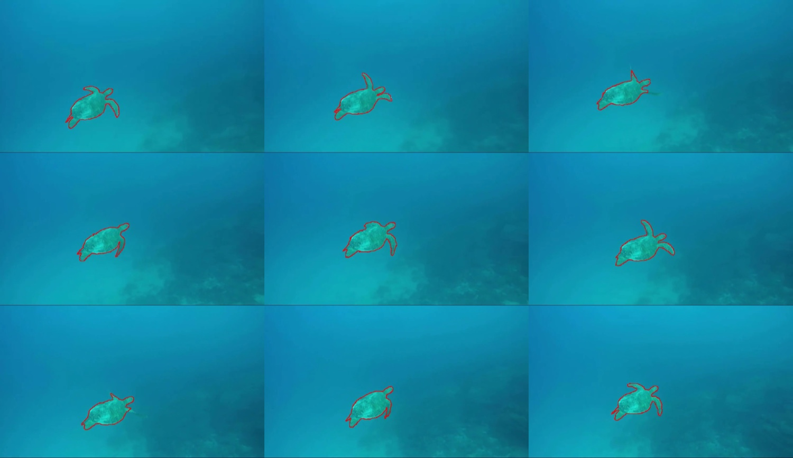
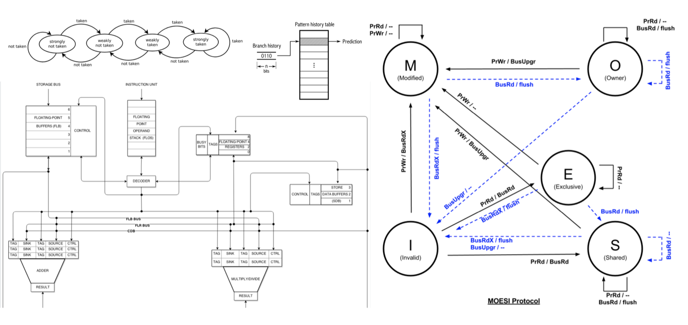
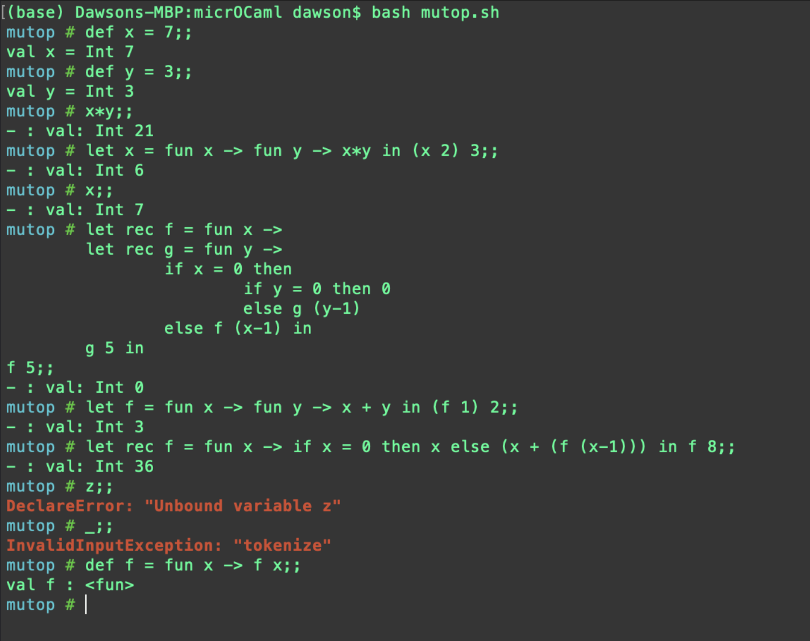
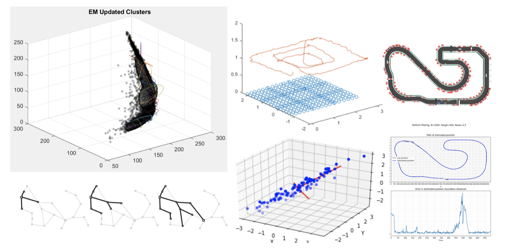

During my Computer Science undergrad at the University of Maryland, I worked on a variety of projects spanning systems architecture, programming languages, computer vision, and machine learning. In an older version of this website, these lived as standalone featured projects. I didn't want to delete them entirely so they've been consolidated here.

## Rotobrush: Video Object Segmentation

With Rotobrush, a user can manually mark the border of an object in the first frame of a video, and Rotobrush will automatically propagate that border across all subsequent frames.

This project was based on a paper called "Video SnapCut" (Bai et al.) that was revolutionary at the time of its release in 2009. SnapCut was immediately included by Adobe Systems in Photoshop, and was only recently replaced by more modern techniques. I am proud that my implementation achieves superior performance to the 2009 version.

If you're interested you can [read the paper here](../../resources/SnapCut.pdf).

**Tech/Tools:** Matlab

## Systems Architecture

In college, I took a computer systems architecture class revolving around optimizing performance of multithreaded and networked systems. I implemented Tomasulo's algorithm, four branch predictors (G-share, Two-Level Adaptive, etc), and three cache coherency protocols (MOESI, etc) for parallelized processors ranging from 4 to 16 cores. Testing my implementations and finding the best hyper-parameters for various processors involved extensive scripting. Some of these projects involved working directly in MIPS Assembly.

**Tech/Tools:** C, C++, MIPS Assembly, Python

## MicroCaml

MicroCaml is my own - albeit simple - programming language. It's Turing complete, and has many of the features of OCaml. I created the lexer, parser, and interpreter from scratch using context free grammar, and created an interactive shell to interface with the programming language from the command line.

As a precursor to designing MicroCaml, I familiarized myself with context free grammar by creating a regular expression engine using NFAs and DFAs.

**Tech/Tools:** OCaml

## ML Projects

My computer science concentration was in machine learning, so I've had exposure to much of the machine learning lifecycle. This includes scraping data, preprocessing and preparing data, data analysis and presentation, designing, training, debugging, and testing model architectures, and integrating the results into existing applications.

I've developed a variety of traditional models from scratch, including neural networks (backpropagation and gradient descent too), transformers, CNNs, autoencoders, softmax regression and classification, embeddings, PCA, simulated annealing, A* search, particle filters, Kalman filters, entropy based decision trees, Bayes nets, GMMs, ensemble methods, and more. I've also used techniques to support model development such as ANMS, RANSAC, SfM, SLAM, factor graphs, GTSAM, importance sampling, and more.

**Tech/Tools:** Python, Matlab, TensorFlow, Numpy, Pandas
