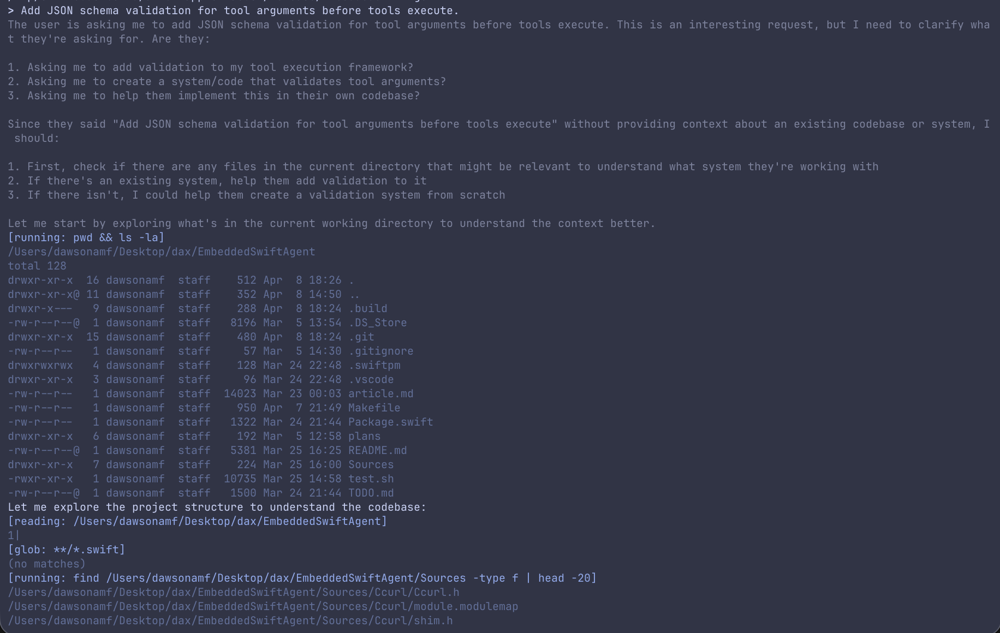

A few months ago I stumbled across [obra/smallest-agent](https://github.com/obra/smallest-agent), a repo that defines a fully functional coding agent (the core of Claude code, OpenClaw, etc.), but in as few bytes as possible. Stripped down it’s one single 493 byte file defining the agent loop; sending messages to Anthropic’s api, a command line tool, waiting for and executing those tool calls, and printing to the terminal. That’s it. 493 bytes is not a lot. To put it in perspective, this paragraph is also exactly 493 bytes.

As a software engineer, I've been working with coding agents for nearly two years. To see that the core logic could be implemented so simply was kind of awesome. Naturally I spun up Docker and built for Linux distribution, excited to see the smallest compiled binary I had ever seen. I was very disappointed. Smallest-agent uses Bun as the runtime, and therefore must pull in all of Bun's dependencies. Without those dependencies, that one file wouldn't know how to make an HTTPS request, parse JSON, spawn a process, or read an environment variable. It couldn't write to the terminal, handle async execution, or catch a Ctrl+C. The 493 bytes describe what the agent does, and absolutely nothing else. It's standing on the shoulders of the giant that is Bun's runtime. Compiled, the actual binary size was around 95 megabytes.

While defining the core agent loop in 493 bytes is cool and educational, I became interested in how small I could make the total binary. I was working primarily with Swift at this point, and had been poking around the Swift forums and looking for an excuse to install a dev toolchain. At this point in my career, I'd heard about embedded systems but never really thought too hard about what working with them implied. So I decided to see if I could pull this off in embedded Swift.

## Plain Swift

To start off, I implemented the agent loop in plain Swift. This was relatively straightforward and clean to look at. I added a few features beyond smallest-agent that I thought were useful enough to be worth adding: streaming responses via SSE, parallel tool execution, subagents that could spawn their own conversation contexts, and real-time steering so you could redirect the agent between tool calls. Foundation gave me URLSession for networking, JSONEncoder/JSONDecoder with Codable for serialization, and Process for spawning shell commands. Swift's async/await handled concurrency. The code read like what you'd expect from any standard Swift project. But, because I pulled in Foundation, the compiled binary was around 76 megabytes.

## The Embedded Swift Rabbit Hole

So, I installed the swift dev nightly toolchain and set the flag to build for embedded Swift. I thought wasn't using very many Swift language features, so I figured it may be a minor cleanup to get it to run. I was completely wrong. Almost everything I took for granted lives in Foundation. Without it, URLSession was gone. Even Codable was gone. The concurrency model I had been using since college was gone. There was no Process, no type erasure, and much of the String API was gone too. It seemed like all I got was structs, enums, generics, closures, and (most importantly) C interop.

## Building a Foundation with C

### Networking

No `URLSession` means wrapping libcurl via C interop. But Swift can't call variadic C functions, and `curl_easy_setopt` is variadic — it takes a `CURLoption` and then whatever type that option expects. So the first thing I wrote was `shim.h`: a set of static inline C wrappers that turn each variadic call into a strongly-typed one.

```c
static inline CURLcode curl_easy_setopt_string(CURL *curl, CURLoption option, const char *param) {
    return curl_easy_setopt(curl, option, param);
}

static inline CURLcode curl_easy_setopt_writefunc(CURL *curl, curl_write_callback callback) {
    return curl_easy_setopt(curl, CURLOPT_WRITEFUNCTION, callback);
}
```

Then there's the streaming problem. An LLM API sends SSE, which is a stream of newline-delimited JSON chunks. libcurl delivers data in arbitrarily-sized buffers via a C callback. The callback needs to buffer bytes, split on newlines, and invoke a Swift closure for each complete line.

The solution I found is to use `Unmanaged`. You can't pass a Swift closure directly through a C function pointer, but what you can do is wrap a Swift object in `Unmanaged`, turn it into an opaque pointer, pass it along as `CURLOPT_WRITEDATA`, and pull it back out inside via the `@convention(c)` callback:

```swift
let ctx = StreamContext(onLine: onLine, abortFlag: abortFlag)
let ctxPtr = Unmanaged.passRetained(ctx).toOpaque()
defer { Unmanaged<StreamContext>.fromOpaque(ctxPtr).release() }

curl_easy_setopt_writefunc(curl, curlWriteCallback)
curl_easy_setopt_writedata(curl, ctxPtr)
```

Inside the callback, you recover the context, buffer bytes, and split on `0x0A`. The abort flag is wired through too. If the user hits Ctrl+C, the callback returns 0, which tells curl to abort the transfer. Clean cancellation from a signal handler, through C, into a Swift object, back through C, into libcurl. I know if this is particularly beautiful, but it does work.

### Shell

No `Process` means we must use `posix_spawn` -- pipe management, environment passing, stdout/stderr merging, all manually. The implementation I went with creates a pipe, sets up `posix_spawn_file_actions` to redirect the child's stdout and stderr to the write end, spawns `/bin/sh -c <command>`, reads from the read end until EOF, then `waitpid`s for the exit code.

```swift
posix_spawn_file_actions_adddup2(&fileActions, writeEnd, STDOUT_FILENO)
posix_spawn_file_actions_adddup2(&fileActions, writeEnd, STDERR_FILENO)
posix_spawn_file_actions_addclose(&fileActions, readEnd)
posix_spawn_file_actions_addclose(&fileActions, writeEnd)
```

The exit code extraction was its own joy to work with. I ended up manually decoding the `waitpid` status with bitwise operations to distinguish normal exits from signal kills.

### String operations

Embedded Swift's standard library doesn't include the Unicode normalization and grapheme-breaking tables. This means `String.count`, `range(of:)`, `hasPrefix(_:)`, and `replacingOccurrences(of:)` either don't exist or pull in massive tables that blow up the binary.

The solution is to put everything through the UTF-8 view. Byte-level comparisons, byte-level searching, byte-level truncation, etc. So I made `utf8HasPrefix`, `utf8Equal`, `utf8DropFirst`, `utf8Truncate`: A collection of functions that do what the standard library does, but by iterating raw bytes:

```swift
func utf8HasPrefix(_ s: String, _ prefix: String) -> Bool {
    var si = s.utf8.makeIterator()
    var pi = prefix.utf8.makeIterator()
    while let pb = pi.next() {
        guard let sb = si.next(), sb == pb else { return false }
    }
    return true
}
```

This is not Unicode correct in the general case, but for an agent that's parsing ASCII heavy SSE streams and JSON, it's probably fine, and it keeps the binary small.

### Concurrency

Embedded Swift does not have the concurrency tools we're used to working with in Swift. There is no `async/await`, `Task`, `DispatchQueue`, etc. We need to add concurrency manually. When the LLM requests multiple tool calls, they need to run in parallel. When the user types while the agent is running, that input needs to be captured on a background thread and routed to the right queue.

The answer: raw pthreads, mutexes, and condition variables. The `ThreadSafeQueue` is a FIFO backed by a pthread mutex and condition variable, with `push`, `popFirst`, and `waitAndPop(timeoutMs:)`. The `InputReader` kicks off a background thread that constantly listens to the terminal, routing your input to the steering queue when the agent is busy working, or straight to the direct input queue when it's idle.

Parallel tool execution works by spawning one pthread per tool call, each with its own `ParallelToolContext` passed through `Unmanaged`:

```swift
let ctxPtr = Unmanaged.passRetained(ctx).toOpaque()
if let handle = sc_thread_create(parallelToolCallback, ctxPtr) {
    threadHandles.append(handle)
}
```

Results land in a `ParallelResultsBox`; a mutex-protected array of optionals, one slot per thread. After all threads are joined, results are collected.

### Signals and atomics

The mechanism that lets you cancel an LLM request by hitting Ctrl+C (the abort flag) is a `volatile sig_atomic_t` allocated over in C. We have to do it in C because you just can't hook up a SIGINT handler directly from Embedded Swift (since there are no bindings for `signal()` or `sigaction()`), and signal handlers can only safely write to a `volatile sig_atomic_t`. On the Swift side, we just wrap it up in an `AbortFlag` class that handles reading and writing via opaque pointer calls:

```swift
final class AbortFlag: @unchecked Sendable {
    private let flag: OpaquePointer

    func isSet() -> Bool {
        sc_atomic_flag_read(UnsafeMutableRawPointer(flag)) != 0
    }
}
```

### argc/argv

There's no `CommandLine.arguments` in Embedded Swift. On macOS, you can use `_NSGetArgc()`/`_NSGetArgv()`. On Linux, you need a `__attribute__((constructor))` function in C that captures `argc` and `argv` before `main` runs. The Swift side calls `sc_get_argc()` and `sc_get_argv(index)`, which are C functions defined in `Cstdio.h`.

## The JSON Problem

The `Any` type doesn't exist in Embedded Swift. I had always thought this sounded like a side note until I tried to work with JSON. This means we don't get existentials or type erasure. 

JSON is inherently heterogeneous. An object's values can be strings, numbers, booleans, nulls, arrays, or nested objects, all in the same object container. In standard Swift, `JSONSerialization` gives you `[String: Any]` and you cast your way through it. With `Codable`, you define structs and the compiler generates the mapping automatically. I didn't know this but apparently both rely on `Any` and runtime reflection.

In Embedded Swift, neither exists.

First I tried using a pure Swift enum:

```swift
enum JSONValue {
    case string(String)
    case number(Double)
    case bool(Bool)
    case null
    case array([JSONValue])
    case object([(String, JSONValue)])
}
```

This would work on a technical level, but creating more complicated (especially nested) JSON objects becomes hard to read, and we still need a parser.

Things like generic approaches, protocol-based abstractions, and result builders all won't work because they need `Any` or runtime type metadata.

The solution I found is to wrap [cJSON](https://github.com/DaveGamble/cJSON), a small single file C library for JSON parsing and generation. The Swift wrapper is a `JSONValue` class with RAII semantics:

```swift
final class JSONValue: @unchecked Sendable {
    let pointer: UnsafeMutablePointer<cJSON>
    private var owned: Bool
    private let root: JSONValue?
}
```

Every `JSONValue` is either *owned* (it will `cJSON_Delete` its tree on `deinit`) or *borrowed* (it holds a strong reference to its root, keeping the tree alive via ARC). When you attach a child to a parent (like adding a key-value pair to an object) the child calls `relinquishOwnership()` so it won't double-free when it goes out of scope.

```swift
subscript(key: String) -> JSONValue? {
    set {
        guard let newValue else { return }
        cJSON_AddItemToObject(self.pointer, key, newValue.pointer)
        newValue.relinquishOwnership()
    }
}
```

It's kinda funny to be writing manual memory management in Swift, a language famous for safely managing memory on its own. But it works, and most importantly it's fast and keeps the binary small. The entire JSON layer is ~170 lines of Swift wrapping an existing C library.

Building an API request looks like this:

```swift
let root = JSONValue.object()
root?["model"] = .string(model)
root?["stream"] = .bool(true)
root?["messages"] = .array(messages.map { $0.toJSON() })
```

This is definitely more verbose than `try JSONEncoder().encode(request)`. But it's done with no reflection, no runtime metadata, and no hidden allocations. Just pointer manipulation (with a safety net).

## The Agent Builds Itself

I've worked with C before, but never to this extent. Luckily, I had a coding agent handy that could help me. Once the initial implementation was working in Swift, I used the agent to help port itself to embedded Swift. Most of the code in this repository was written by the agent running inside its own binary. The final numbers are below: A 195 kilobyte binary that boots in 120 milliseconds. This agent, significantly more fully featured than obra/smallest-agent, is smaller than most JPEGs. If you want to try running it yourself, clone it from [dawsonamf/EmbeddedSwiftAgent](https://github.com/dawsonamf/EmbeddedSwiftAgent) and follow the instructions in the README.



The final numbers:


| Metric                        | Value                                                                                         |
| ----------------------------- | --------------------------------------------------------------------------------------------- |
| macOS arm64 stripped binary   | **183.7 KB** (188,176 bytes)                                                                  |
| Linux aarch64 stripped binary | **195.0 KB** (199,680 bytes)                                                                  |
| Startup to interactive prompt | **~120 ms** (mean of 30 runs, σ=1.9ms)                                                        |
| Tools                         | 10 (sh, read_file, write_file, str_replace, glob, grep, web_search, web_fetch, subagent, mcp) |
| Swift source files            | 16                                                                                            |
| C shim/support headers        | 4                                                                                             |
| External C libraries vendored | 2 (cJSON, libcurl via system)                                                                 |


[github.com/dawsonamf/EmbeddedSwiftAgent](https://github.com/dawsonamf/EmbeddedSwiftAgent)