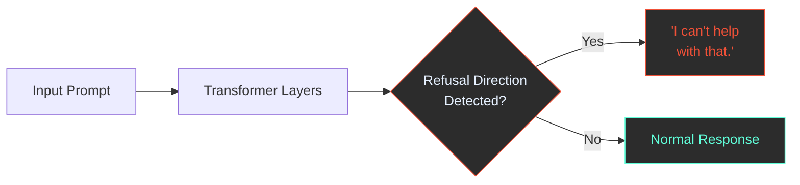
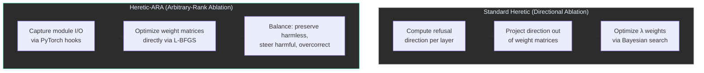

Google's Gemma 4 is one of the most architecturally interesting open models released this year. The 26B A4B variant is a Mixture-of-Experts model with 25.2 billion total parameters but only 3.8 billion active at inference time, making it nearly as fast as a 4B model while punching far above its weight on benchmarks. I wanted to explore the alignment boundary of this model — specifically, how much of its safety refusal behavior could be removed while preserving its general capabilities. To do this, I used [Heretic](https://github.com/p-e-w/heretic), an open-source tool for automatic censorship removal, with its experimental Arbitrary-Rank Ablation (ARA) method.

The result is two fine-tuned variants sitting at different points on the Pareto frontier between KL divergence (how much the model's behavior drifts from the original) and refusal suppression (how many safety refusals are removed). Both the raw weights and GGUF quantizations are published on [HuggingFace](https://huggingface.co/dawsonamf). Benchmarks against the vanilla model are planned.

## What is Abliteration?

Before diving into Heretic and ARA, it helps to understand the broader idea of *abliteration* — the process of removing a model's refusal behavior after it's been safety-trained.

Modern language models go through a multi-stage training pipeline. First, they're pre-trained on a massive corpus to learn language. Then they're fine-tuned with techniques like RLHF (Reinforcement Learning from Human Feedback) or DPO (Direct Preference Optimization) to align their behavior with human preferences, including learning when to refuse requests. This alignment isn't a separate module bolted on top — it's woven into the model's weights throughout its layers.

Mechanistic interpretability research has shown that refusal behavior in transformer models can often be traced to a specific *direction* in the model's internal representation space. When the model processes a prompt it considers harmful, the residual stream activations shift along this refusal direction, which ultimately causes the model to output a refusal response instead of complying.

Abliteration exploits this. The idea is: if you can identify the refusal direction, you can project it out of the model's weight matrices, effectively removing the model's ability to refuse. The model still has all of its knowledge and capabilities — it just loses the specific mechanism that triggers refusals.



## Standard Heretic: Directional Ablation

[Heretic](https://github.com/p-e-w/heretic) automates this process. Rather than requiring a researcher to manually identify refusal directions and tune ablation weights by hand, Heretic uses Bayesian optimization (via Optuna's TPE sampler) to automatically search for the best parameters.

The standard Heretic pipeline works in three steps:

1. **Compute refusal directions.** For each transformer layer, Heretic runs a set of "harmful" and "harmless" prompts through the model and records the internal activations. The difference between the mean activation vectors for harmful vs. harmless prompts gives the refusal direction for that layer.

2. **Orthogonalize weight matrices.** Heretic modifies the attention output projections and MLP down-projections in each layer to suppress the refusal direction. The core operation is: `ΔW = -λ · v · (vᵀ · W)`, where `v` is the refusal direction and `λ` is the ablation weight. This projects out the refusal component from the weight matrix.

3. **Optimize automatically.** Instead of applying a single `λ` across all layers, Heretic uses a parametric kernel (a bell-curve weighting across layers) with multiple tunable parameters. Optuna searches over these parameters, evaluating each trial by counting refusals on a test set and measuring KL divergence on harmless prompts. The result is a Pareto frontier of configurations trading off refusal suppression against behavioral drift.

This approach works well for many models. But Gemma 4 introduced a complication.

## The Gemma 4 Problem

Gemma 4 ships with a custom layer type called `Gemma4ClippableLinear` in its vision and audio encoders. This layer wraps `nn.Linear` with optional input/output clamping for numerical stability, but critically, it inherits from `nn.Module` rather than `nn.Linear`.

This breaks the standard Heretic pipeline. When Heretic (or any PEFT-based tool) tries to identify linear layers in the model for modification, it checks module types. Since `Gemma4ClippableLinear` isn't recognized as a linear layer, the tool either crashes or skips those modules entirely. Even though the text decoder layers (which are the ones we actually want to modify) are standard linear layers, PEFT's type-checking runs before any filtering, so the mere *presence* of unrecognized types in the vision encoder causes the entire process to fail.

The workaround for LoRA-based fine-tuning involves monkey-patching the class to inherit from `nn.Linear` before loading the model:

```python
import torch.nn as nn
from transformers.models.gemma4 import modeling_gemma4

class PatchedClippableLinear(nn.Linear):
    def __init__(self, config, in_features, out_features):
        nn.Linear.__init__(self, in_features, out_features, bias=False)
        self.use_clipped_linears = getattr(config, "use_clipped_linears", False)
        if self.use_clipped_linears:
            self.register_buffer("input_min", torch.tensor(-float("inf")))
            self.register_buffer("input_max", torch.tensor(float("inf")))
            self.register_buffer("output_min", torch.tensor(-float("inf")))
            self.register_buffer("output_max", torch.tensor(float("inf")))

    def forward(self, x):
        if self.use_clipped_linears:
            x = torch.clamp(x, self.input_min, self.input_max)
        out = nn.Linear.forward(self, x)
        if self.use_clipped_linears:
            out = torch.clamp(out, self.output_min, self.output_max)
        return out

modeling_gemma4.Gemma4ClippableLinear = PatchedClippableLinear
```

But this is a LoRA workaround. Standard Heretic's directional ablation doesn't use LoRA — it modifies weight matrices directly. The `Gemma4ClippableLinear` issue still affects how Heretic traverses and identifies modules in the model graph. This is where Heretic-ARA comes in.

## Heretic-ARA: Arbitrary-Rank Ablation

ARA is an experimental abliteration method developed by Heretic's author ([PR #211](https://github.com/p-e-w/heretic/pull/211)) that takes a fundamentally different approach. Instead of computing refusal directions and projecting them out of weight matrices, ARA works by:

1. **Capturing module I/O.** Using PyTorch hooks, ARA records the input and output tensors at each individual transformer module for both harmful and harmless prompts.

2. **Direct matrix optimization.** For each module, ARA uses L-BFGS (a quasi-Newton optimization algorithm) to directly modify the module's weight matrix, guided by an objective function that encodes three competing goals.

3. **Balancing three objectives simultaneously:**
   - **Preserve harmless behavior:** The outputs for harmless prompts should change as little as possible.
   - **Steer harmful toward harmless:** The outputs for harmful prompts should become similar to those for harmless prompts.
   - **Overcorrect away from harmful:** The outputs for harmful prompts should also move *away* from their original values, overcorrecting past the harmless centroid for stronger steering.

<div id="ara-objectives-chart"></div>
<p class="chart-caption">Conceptual visualization of ARA's three optimization objectives. The optimizer pushes harmful outputs toward (and past) the harmless cluster while keeping harmless outputs stable.</p>

The key insight is that ARA doesn't assume anything about the *rank* of the refusal manifold. Standard abliteration assumes refusal lives along a single direction (rank 1). Multi-directional methods like SOMA assume it lives in a low-dimensional subspace. ARA makes no such assumption — it lets the optimizer find whatever transformation best satisfies the objective, regardless of how many dimensions the refusal behavior spans. This is why it's called *Arbitrary-Rank* Ablation.

Because the objective is affine-convex and the starting point (the original weight matrix) is already close to the optimum, L-BFGS typically converges in 2-3 iterations per module. Matrices are optimized one-by-one, so memory requirements are barely higher than standard abliteration.

### Why ARA Works Better for Gemma 4

ARA's hook-based approach is more robust to non-standard module types. Instead of needing to identify and classify every layer type in the model, ARA simply attaches hooks to the modules it wants to modify and captures their behavior empirically. It doesn't care whether a module inherits from `nn.Linear` or `nn.Module` — it only needs to be able to read the inputs and outputs and modify the weight matrix. This makes it naturally compatible with Gemma 4's custom layer types without requiring monkey-patches.

## The Pareto Frontier

When running Heretic-ARA, the optimizer explores many different parameter configurations across trials. Each trial produces a model with a specific refusal count and KL divergence score. The Pareto frontier is the set of trials where no other trial is strictly better on both metrics — you can't reduce refusals further without increasing KL divergence, and vice versa.

I ran the optimization on the Gemma 4 26B A4B model using a RunPod instance (<insert pod spec here>) and selected two points from the Pareto frontier to publish:

| Variant | Refusals (out of 100) | KL Divergence | Layers Modified |
| --- | --- | --- | --- |
| **R3-KL4059** | 3 | 0.4059 | 7–20 |
| **R9-KL1077** | 9 | 0.1077 | — |
| Vanilla Gemma 4 26B A4B | 100 | 0 (by definition) | — |

<div id="pareto-chart"></div>
<p class="chart-caption">Pareto frontier showing the tradeoff between refusal suppression and KL divergence. Lower-left is better on both axes. The two published models are highlighted.</p>

The **R3-KL4059** variant is the aggressive option: only 3 refusals out of 100 test prompts, but with a KL divergence of 0.4059, meaning the model's output distribution has shifted meaningfully from the original. The **R9-KL1077** variant is the conservative option: 9 refusals remain, but KL divergence is only 0.1077, meaning the model behaves almost identically to the original on harmless prompts.

### What KL Divergence Actually Means Here

KL divergence (Kullback-Leibler divergence) measures how different two probability distributions are. In this context, it's computed by running a set of harmless prompts through both the original and modified models and comparing their output token distributions. A KL divergence of 0 means the distributions are identical. Higher values mean the modified model's outputs have drifted further from the original.

The important thing to understand is that KL divergence doesn't measure *quality* — it measures *difference*. A model with high KL divergence might be better or worse than the original; it's just more different. But in practice, lower KL divergence is preferred because it means the abliteration process changed only what it needed to (refusal behavior) without disturbing the model's general capabilities.

<div id="kl-explainer-chart"></div>
<p class="chart-caption">KL divergence measures how much the modified model's output distribution has shifted from the original. Lower means less behavioral drift on harmless prompts.</p>

### Abliteration Parameters

For the R3-KL4059 variant, the optimizer selected these parameters:

| Parameter | Value |
| --- | --- |
| start_layer_index | 7 |
| end_layer_index | 20 |
| preserve_good_behavior_weight | 0.9631 |
| steer_bad_behavior_weight | 0.0001 |
| overcorrect_relative_weight | 1.2387 |
| neighbor_count | 14 |

The `preserve_good_behavior_weight` of 0.9631 means the optimizer heavily prioritized keeping harmless outputs unchanged. The `steer_bad_behavior_weight` is tiny (0.0001), meaning the "make harmful look like harmless" objective was given very little weight. The `overcorrect_relative_weight` of 1.2387 means the overcorrection term (pushing harmful outputs *away* from their original state) was the dominant steering force. This is an interesting result — it suggests that for Gemma 4, overcorrection is more effective than direct steering for suppressing refusals.

## Directional Ablation vs. ARA

To summarize the two approaches:



| | Directional Ablation | ARA |
| --- | --- | --- |
| **Assumption** | Refusal lives along a single direction | No assumption about refusal rank |
| **Method** | SVD/PCA to find direction, then project it out | L-BFGS optimization against multi-objective loss |
| **Parameters** | Ablation weight λ per layer (bell-curve kernel) | 3 objective weights + layer range |
| **Compatibility** | Requires standard `nn.Linear` layers | Works with any module via hooks |
| **Speed** | Fast (no optimization loop per module) | Slightly slower (L-BFGS per module, but fewer trials needed) |

## The Models

Both variants are available on HuggingFace in raw safetensors format and as GGUF quantizations for use with llama.cpp, Ollama, LM Studio, and other local inference tools:

- [dawsonamf/gemma-4-26b-a4b-it-heretic-ara-r3-kl4059](https://huggingface.co/dawsonamf/gemma-4-26b-a4b-it-heretic-ara-r3-kl4059) (raw weights)
- [dawsonamf/gemma-4-26b-a4b-it-heretic-ara-r3-kl4059-GGUF](https://huggingface.co/dawsonamf/gemma-4-26b-a4b-it-heretic-ara-r3-kl4059-GGUF) (quantized)
- [dawsonamf/gemma-4-26b-a4b-it-heretic-ara-r9-kl1077](https://huggingface.co/dawsonamf/gemma-4-26b-a4b-it-heretic-ara-r9-kl1077) (raw weights)
- [dawsonamf/gemma-4-26b-a4b-it-heretic-ara-r9-kl1077-GGUF](https://huggingface.co/dawsonamf/gemma-4-26b-a4b-it-heretic-ara-r9-kl1077-GGUF) (quantized)

## What's Next

I plan to run both variants through a comprehensive benchmark suite and compare the results against the vanilla Gemma 4 26B A4B model. The goal is to quantify exactly how much general capability is preserved (or lost) at each point on the Pareto frontier, and whether the KL divergence numbers are predictive of benchmark degradation. If the R9-KL1077 variant maintains benchmark parity while suppressing most refusals, that would be a strong signal that ARA's optimization objective is well-calibrated. If not, it'll be interesting to see where the degradation shows up and whether it correlates with the specific layers that were modified.

[huggingface.co/dawsonamf](https://huggingface.co/dawsonamf)
