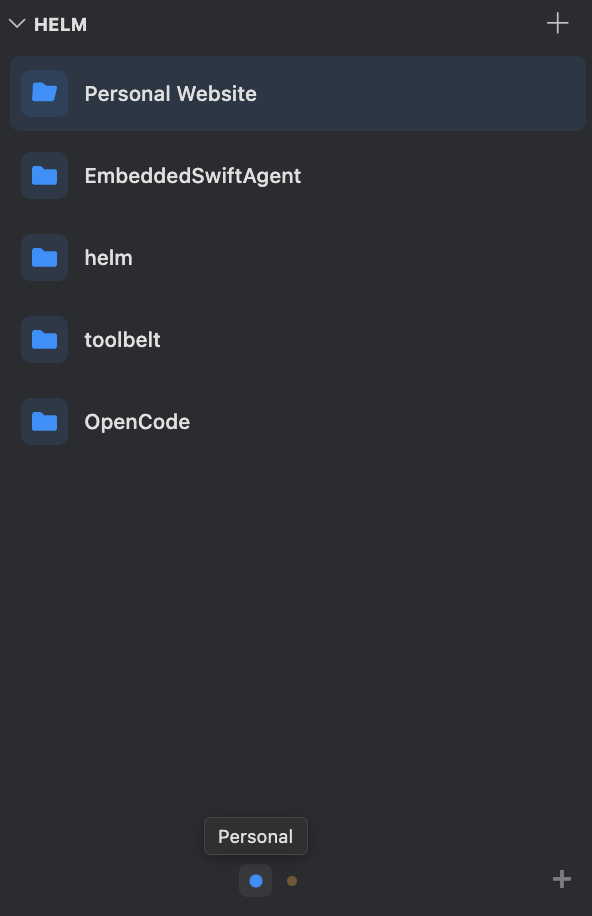
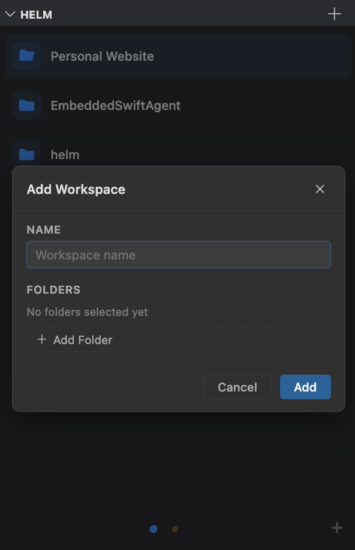
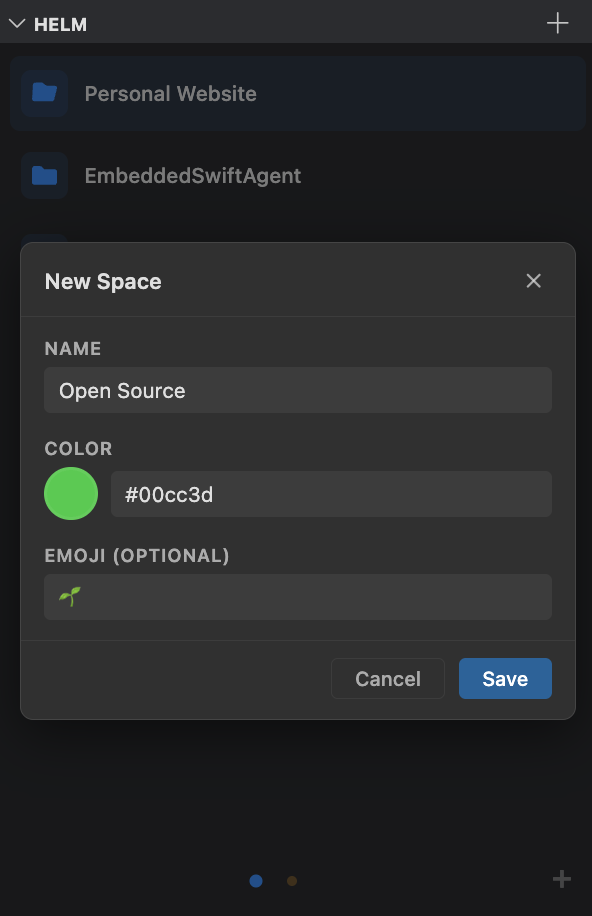

I work on lot of projects. Between work, personal projects, and open source, I probably have over a dozen project directories I switch between regularly. Since I often work with multi-root workspaces (multiple folders open at once in a single VSCode/Cursor winow), it's worse; you have to manually "Add Folder to Workspace" every time, or manage the `.code-workspace` manually. In practice, what this meant was I had a dozen Cursor windows open at once, each in a different Desktop window on my mac grouped by concept/scope. Organizing the windows on my machine was a job on its own, and god forbid there was an update. If Cursor restarted it would group all workspaces together in the same Desktop window and I'd have to spend a few minutes sorting out the windows again. In the grand scheme of things this isn't an enormous deal, only costing a few minutes of work and a few units of mental effort, but it got to be annoying. I began to find myself choosing to not clone a repo, stub out an idea, or even update my IDE just because I didn't think it was worth adding to the overhead that was my project window management.

I love Arc. Arc has been my default browser since early 2023. The tab management is clean, and the mental abstraction of Spaces is elegant. I wanted an Arc style sidebar in my IDE, one that would let me switch between workspaces like I switch between tabs, and group workspaces in "spaces" by context (i.e. work, personal, etc). So I built it.

<div style="clear: both;"></div>

## The Idea

Helm lives in the Explorer sidebar as a webview panel. You save workspaces, organize them into spaces, and click to switch. The mental model is nearly exactly that of Arc. Each space has a name, color, and an optional emoji. At the bottom of the panel, colored dots represent your spaces, and you can swipe between them with a trackpad or click a dot to jump. Workspaces within a space are "cards" you can drag to reorder, and you can drag a workspace card onto a different space's dot to move it to that space.

## Architecture

The extension is three TypeScript files bundled with esbuild:

- `extension.ts` handles activation, registers the webview, and wires up the commands. It's the router between the UI and the data layer.
- `workspaceTreeProvider.ts` is the data layer. It reads and writes `helm.spaces` in VS Code's global user settings, manages  the `.code-workspace` files, etc.
- `webviewProvider.ts` generates the UI.

When you click a workspace card, the webview sends a `postMessage` to the extension host, which calls `openWorkspace`. Single-folder workspaces open directly via `vscode.openFolder`, and multi-folder workspaces first write a `.code-workspace` file to the extension's global storage directory, then open that:

```typescript
function openWorkspace(treeProvider: WorkspaceTreeProvider, entry: WorkspaceEntry, newWindow: boolean): void {
  if (entry.paths.length === 1) {
    vscode.commands.executeCommand('vscode.openFolder', vscode.Uri.file(entry.paths[0]), newWindow);
    return;
  }

  const wsFile = treeProvider.getWorkspaceFilePath(entry);
  if (wsFile) {
    treeProvider.writeWorkspaceFile(entry);
    vscode.commands.executeCommand('vscode.openFolder', vscode.Uri.file(wsFile), newWindow);
  }
}
```

All persistent data lives in VS Code's user settings under `helm.spaces`. This means if you have settings sync enabled, your workspaces sync across machines for free, and transfer between IDEs if they support migrating VSCode settings. The tradeoff is that your settings file grows with your workspace list, but in practice the JSON should be small. If you'd like to improve this with a PR go please go right ahead.

## The Webview



The entire UI is a single HTML string generated in TypeScript. No React, no Vue, no build step for the frontend. The `_getHtml` method returns a complete document with inline `<style>` and `<script>` tags. Initial data is serialized into the script as a JSON literal.

I went with this approach because VS Code webviews are sandboxed and the UI is simple enough that a framework would be overhead without much benefit. Also, The UI is short enough for an LLM to work with all at once, and doing so reduces tool call overhead.

The CSS makes use of VS Code's theme variables (`--vscode-foreground`, `--vscode-list-hoverBackground`, etc.) so the panel looks native regardless of which theme you're using. Security is handled with a Content Security Policy that uses a per-render nonce on the script tag, so only the inline script generated by the extension can execute. The webview is registered with `retainContextWhenHidden: true` so it doesn't reload every time you collapse and expand the Explorer sidebar.

The swipe gesture detection listens for horizontal `wheel` events on the viewport, accumulates `deltaX`, and triggers a page transition once a threshold is crossed. This gives you trackpad swipe navigation between spaces that feels similar to swiping between spaces in Arc. Arc's is definitely snappier though; an area for improvement eventually.

<div style="clear: both;"></div>

## Spaces



Spaces are the organizational layer. Each space is an object with an id, name, color, optional emoji, and an array of workspaces:

```typescript
interface Space {
  id: string;
  name: string;
  color: string;
  emoji?: string;
  workspaces: WorkspaceEntry[];
}
```

The active space is tracked in `context.globalState`, not in settings. This keeps it ephemeral and per-window, so opening a new window doesn't clobber your space selection in another.

You can drag workspace cards between spaces by dragging a card over a different space's dot in the bottom bar. When you hover over a dot for 500ms, the view animates to that space and opens a gap where the card will land. Space dots themselves are also draggable for reordering.

<div style="clear: both;"></div>

## Distribution

Helm isn't on the VS Code Marketplace. It's distributed as a `.vsix` file through GitHub Releases. I made an install script that handles the whole process:

```bash
curl -fsSL https://raw.githubusercontent.com/dawsonamf/helm/main/install.sh | bash
```

The script detects whether you have Cursor, VS Code, or both installed (in which case it lets you pick which to install into), downloads the latest `.vsix` from the GitHub API, and runs the install command. For local development there's a Makefile that packages, installs, and restarts the editor (the editor must restart to test changes) in one command.

[github.com/dawsonamf/helm](https://github.com/dawsonamf/helm)