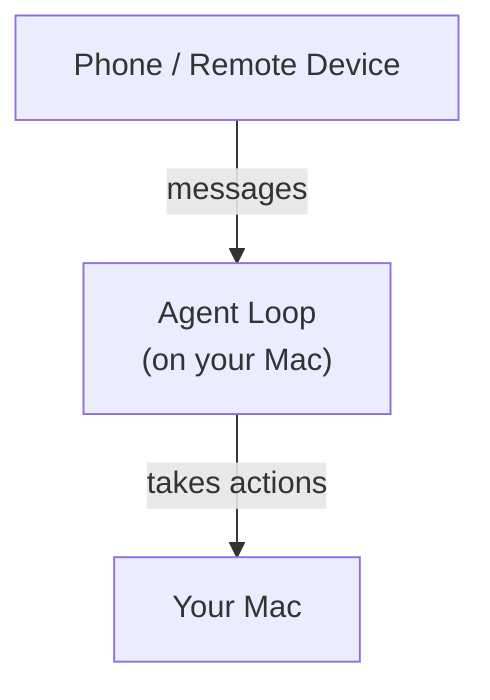
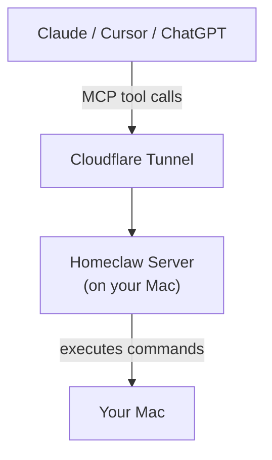

One of the early features that I think was key in driving the rapid growth of OpenClaw was channels — the ability to take actions on your computer through an agent by messaging it from your phone. The agent loop was running on your computer, but you could interact with the loop from anywhere. This is now a fairly standard feature in Claude Code and other coding agents, but at the time it was novel.

The value proposition was twofold and roughly as follows:   

1. an agent loop is running on your computer, so it can take actions inside your filesystem and on your device, and
2. you can message this agent from anywhere, thereby taking actions on your computer from anywhere.

This got me thinking. There is no reason why the agent loop that controls your computer has to be running on your computer. All it needs is a tunnel, a way to send commands that get executed on your computer. Thus the idea for homeclaw was born.

**Traditional (e.g. Claude Code, OpenClaw)**



**Homeclaw**



Homeclaw is a remote MCP server running on your computer, meaning any agent or chatbot that supports MCPs can use it. Homeclaw exposes 3 tools:

- `run_command` — execute a shell command on your machine
- `list_skills` — list available SKILL.md files with their frontmatter so the agent can discover what skills exist
- `read_skill` — read the full contents of a specific SKILL.md file so the agent can load it into context

## How it works

The whole thing is about 400 lines of TypeScript running on Bun. When you start it:

1. It loads a bearer token from `~/.homeclaw/token` (you must generate this yourself with openssl)
2. It starts an HTTP server on localhost
3. It opens a Cloudflare Quick Tunnel, which gives you a random HTTPS URL that routes back to your machine
4. It prints the MCP client config to your terminal so you can copy-paste it

Each incoming request gets a fresh MCP server instance, so there's no session state to worry about.

## Auth

The bearer token is the security boundary, so treat it like an SSH key. Anyone who has it can run arbitrary commands on your machine.

I also implemented OAuth 2.0 because some MCP clients (Like ChatGPT) require it. the OAuth flow exists purely to fit the shape of these clients, and just auto approves everything. These OAuth credentials get auto-generated on first launch and stored in `~/.homeclaw/`, so they persist across restarts automatically. You can also hardcode them in a config file if you want to set specific values manually.

## Building it

The only real design decision I made was making sure the server was stateless. This means there's no session cleanup, stale state, or side effects from long lived connections to worry about. To that effect, every request creates a new `McpServer` instance.

I wrote it with Bun because I read that Anthropic acquired bun and I wanted to try using Bun. There's a test suite that covers just about everything you can run with `bun test`.

## Command permissions

By default, homeclaw lets the AI run anything. If you want an allowlist, create a`config.json` with glob based rules in the directory you run homeclaw from (or point to one via `CONFIG_FILE`).

```json
{
  "commands": {
    "*": "deny",
    "ls *": "allow",
    "git *": "allow",
    "cat *": "allow"
  }
}
```

The last matching rule wins, so if you deny everything as the first rule, you can allow specific commands after. Keep in mind the code that blocks commands is rudimentary and not battle tested. A sufficiently motivated agent could probably find a way around it.

## Using it

```bash
# install bun if you don't have it
curl -fsSL https://bun.sh/install | bash

# generate a bearer token (treat this like an SSH key)
mkdir -p ~/.homeclaw && openssl rand -base64 32 > ~/.homeclaw/token

# run homeclaw
bunx homeclaw
```

When you run homeclaw, it'll print the config that you need to paste into your preferred agent.

[github.com/dawsonamf/homeclaw](https://github.com/dawsonamf/homeclaw)