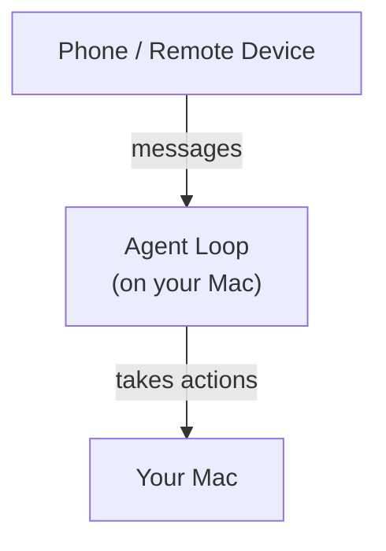
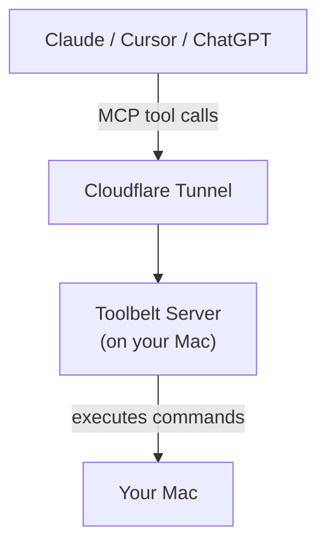

One of the early features that I think was key in driving the rapid growth of OpenClaw was channels — the ability to take actions on your computer through an agent by messaging it from your phone. The agent loop was running on your computer, but you could interact with the loop from anywhere. This is now a fairly standard feature in Claude Code (called Dispatch) and other coding agents, but at the time it was novel.

The value proposition was twofold and roughly as follows:

1. an agent loop is running on your computer, so it can take actions inside your filesystem and on your device, and
2. you can message this agent from anywhere, thereby taking actions on your computer from anywhere.

This got me thinking. There is no reason why the agent loop that controls your computer has to be running on your computer. In theory all it needs is a tunnel, a way to send commands that get executed on your computer. Thus the idea for toolbelt was born.

**Traditional (e.g. Claude Dispatch, OpenClaw)**




**Toolbelt**




Toolbelt is a remote MCP server running on your computer, meaning any agent or chatbot that supports MCPs can use it. It also supports a local stdio mode for clients that run on the same machine (like LM Studio). Toolbelt exposes a configurable set of tools that let it take the same set of actions a standard coding agent running on your machine can take:

- `bash` — execute a shell command on your machine
- `read_file` / `write_file` — read and write files on disk
- `glob` — find files matching a glob pattern
- `grep` — search file contents with ripgrep
- `list_dir` — list directory contents
- `list_skills` — list available SKILL.md files with their frontmatter so the agent can discover what skills exist
- `web_search` / `web_crawl` — search the web and fetch page contents via Exa
- `context7_resolve` / `context7_docs` — look up and fetch library documentation from Context7

Each tool can be toggled on or off in a `tools.toml` config file.

## How it works

The server is written in Python using FastMCP. When you start it:

1. It loads or auto-generates a bearer token at `~/.toolbelt/token`
2. It starts an HTTP server on localhost
3. It opens a Cloudflare Quick Tunnel, which gives you a random HTTPS URL that routes back to your machine
4. It prints the MCP client config to your terminal so you can copy-paste it

You can also run `python server.py --local` for stdio transport with no network exposure (useful for local MCP clients like LM Studio)

## Auth

The bearer token is the primary security boundary, so treat it like an SSH key. Anyone who has it can run arbitrary commands on your machine.

I also implemented OAuth 2.0 because some MCP clients (Like ChatGPT) require it. the OAuth flow exists purely to fit the shape of these clients, and just auto approves everything. These OAuth credentials get auto-generated on first launch and stored in `~/.toolbelt/`, so they persist across restarts automatically. You can also hardcode them in a config file if you want to set specific values manually.

## Building it

The only real design decision I made was making sure the server was stateless. This means there's no session cleanup, stale state, or side effects from long lived connections to worry about.

I wrote it in Python with FastMCP and Starlette. There's a test suite that covers just about everything I could think of that you can run with `pytest`.

## Using it

```bash
# clone and install
git clone https://github.com/dawsonamf/toolbelt.git
cd toolbelt
pip install -e .

# set API keys (add to your shell profile to persist)
export EXA_API_KEY=...        # required for web_search / web_crawl
export CONTEXT7_API_KEY=...   # optional — avoids rate limits

# run in remote mode (Cloudflare tunnel, requires cloudflared)
toolbelt

# or run in local stdio mode
toolbelt --local
```

The bearer token is auto-generated on first run. When you run toolbelt in remote mode, it prints the MCP client config you need to paste into your preferred agent — including the tunnel URL and auth header. You can also rotate all auth credentials (bearer token, OAuth client ID, and client secret) in one shot with `toolbelt --rotate-auth`.

For local mode with LM Studio, add this to `~/.lmstudio/mcp.json`:

```json
{
  "mcpServers": {
    "toolbelt": {
      "command": "toolbelt",
      "args": ["--local"],
      "env": {
        "EXA_API_KEY": "your_exa_key",
        "CONTEXT7_API_KEY": "your_context7_key"
      }
    }
  }
}
```

[github.com/dawsonamf/toolbelt](https://github.com/dawsonamf/toolbelt)