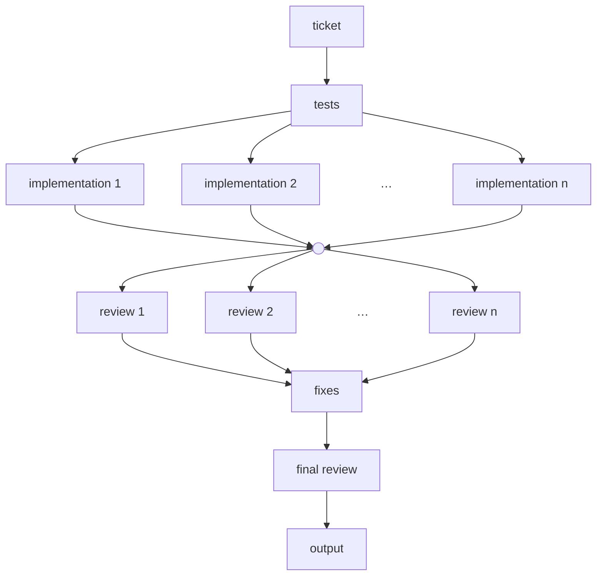

There are those on X and Hacker News who tout loop engineering, graph engineering, and an emerging LLM centered “OS” as the way of the future. They excitedly say “we code in natural language now” and “English is the programming language of the future.” I used to think this was just a figure of speech, that they meant we can produce code with natural language prompts and so are “coding” in it. But over the last few months I’ve become increasingly convinced that there is a deeper meaning behind what they say. This article is meant to shed light on that meaning and is geared towards one specific audience: myself 6 months ago.

As a software engineer, it is my job to produce code. That used to mean writing and reviewing code myself. But this isn’t what I spend most of my time on these days. Instead, I find myself creating workflows that direct agents, experimenting with different development processes, architecture patterns, and codebase structures that let me trust large amounts of LLM generated code and merge lots of PRs very quickly, without accumulating cognitive debt or causing codebase entropy. If you’re curious about the specifics of how this is possible, check out my post on [deep modules](/blog/deep-modules/).

## Implementation workflow

Let's dive into an example workflow.

We know from experience that there is an art to producing quality unreviewed slop. Without diving too deeply into it here, the principles are as follows:

- TDD red/green/(refactor) ([Superpowers](https://github.com/obra/superpowers/blob/main/skills/test-driven-development/SKILL.md), [Matt](https://github.com/mattpocock/skills/blob/main/skills/engineering/tdd/SKILL.md), [Anthropic](https://www.anthropic.com/engineering/claude-code-best-practices)) —
    - Write the tests first so CI turns red. One session should write the tests, and another session should then implement the functionality to make them pass.
    - Implementation can be done with a non frontier model. Experience consistently shows that actually writing the code can be done with a model class below that which architects the feature and reviews the diff.
    - If your application includes an AI assistant and changing its harness (i.e., prompts/skills/tools) is part of the diff, you should have a set of evals for testing it. TDD in this case means writing new evals, watching them fail, updating the harness, and watching them pass.
- Review
    - Fresh context — Review the diff with different agent sessions than the ones that produced it.
    - Adversarial review: reviewers should challenge each other’s findings and ground disagreements in concrete evidence ([Adversarial Review](https://arxiv.org/abs/2608.18167)).
    - Parallel, single round — Models are sycophantic. If you review -> fix -> review -> fix, etc., in a loop until reviewers find no more issues, the loop can drag on, burning tokens without exposing important issues. Practical advice is to fan out multiple reviewers in parallel in one pass, plus maybe a confirmation pass.
    - Different axes — each reviewer should focus on a different axis of review, e.g., correctness, security, codebase standards, etc.

The above sequence of events encodes a workflow. A process. Given a ticket's worth of work, the output from the workflow is well tested, well reviewed slop that is much much better than what a one shot prompt would produce. If you aren’t convinced, I encourage you to try it.

Workflow for producing a ticket's worth of work:

The workflow described above isn't enough for an end to end feature. It encompasses the implementation phase only. It assumes the existence of a ticket sized chunk of work and doesn’t cover the process of producing that chunk of work.

I don't want this article to turn into a list of workflows, but at a high level the workflow for producing a ticket is roughly:
- The user produces an intent/feature idea
- The LLM brainstorms the feature’s details with the user, prototyping along the way if necessary
- The LLM produces a spec from the brainstorming session
- The user and LLM iterate on the spec, planning the change in more detail. This may include architecture, API surface, etc.
- The LLM breaks the spec down into a plan, and the plan down into individual ticket sized work chunks. Each work item is scoped into what would fit into the ~140k token “smart context window” today’s LLMs have.

To summarize, this is the workflow we have drawn up:

## Encoding the workflow

This is a nice workflow. But how do we encode it so that the work actually gets done in this way? There are a few “levels” to this:

- Naive prompting — A user maintains a set of prompts, either in their head or in some file. For each step in the process, they create a new session and enter the relevant prompt. When the output of one session needs to be fed into another session, they are responsible for manually copying and pasting it. This is somewhat brittle and time consuming for a human.
- Orchestrator agent — Give this workflow and all relevant prompts to an agent responsible for spawning subagents. This orchestrator does the prompting/session management instead of the user.
- Hooks/Scripts — create specialized agents and hooks that trigger them, automatically feeding context, spawning the right number of subagents at the right time, etc. Or encode the workflow in traditional code files using claude -p, acpx, or an SDK like LangGraph or Google’s Agent Development Kit to manage agent sessions.

LLM as an OS

An orchestrator agent running the workflow can be thought of as an interpreter.

Think of MCPs, tools, and CLI commands bundled with skills as I/O, context windows as RAM, files and embeddings as disk, and LLMs as CPUs.

In practice, making a workflow usually involves graduating up level by level. I frequently find myself doing everything manually at first, tweaking the workflow bit by bit, then giving the process to an orchestrator to act in my stead, and continuing to tweak it on various runs, and then finally, when I’ve really nailed it down, I can encode it with a script.

## Evals

On top of this, we can keep evals on the workflow and use them to improve results over time. Instead of hoping a change produces better results, keep a set of past issues or feature tickets around as evals and run any workflow tweaks through the eval set to see if performance actually improves. This lets you both optimize and, in some cases, automatically hill climb.

- Optimization — try using Sonnet instead of Opus as the implementor model. Or try running 30 adversarial reviews with Qwen3.8-27B running at ~1850 tok/s on [Cerebras](https://inference-docs.cerebras.ai/models/overview) instead of 3 Fable 5.1 reviewers to see if you can save money or time.
- Hill climbing — tell an agent to look at your session logs and find ways to improve the workflow. Proposed changes get tested with the eval set, and if they result in improvement, can be adopted. New failure cases can be surfaced and result in more evals, leading to a more robust set of test cases for the workflow.

Since the workflows are encoded in files, they can be version controlled in Git, tested, rolled back, etc.

Recursive workflow improvement

- The hill climbing workflow can be encoded as a workflow itself.
- It can be run automatically every so often. It can even have its own set of evals that get hill climbed on — a workflow optimizing itself, recursively.
- If the base workflow was producing LLM training code instead of application code, you can see how this might be an important piece of recursive self improvement.

Increasingly, this is what I find myself spending most of my time on, not just writing and reviewing code, but creating the workflows that write and review code, encoding them, creating evals for them, and tweaking/optimizing them. I think this is what the people on X and Hacker News mean when they say we are coding in natural language. Instead of writing code that directs bytes on the motherboard and pixels on a screen, I’m creating workflows, encoded in natural language, that direct intelligence. Intelligence is the substrate I work with now, the code it produces is just a byproduct.
